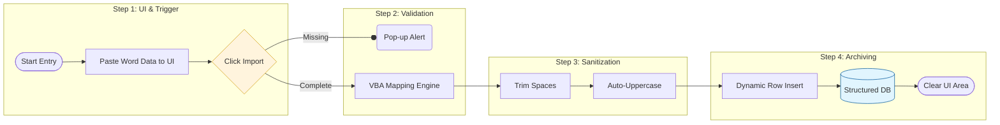
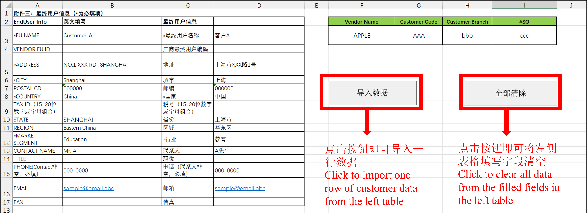
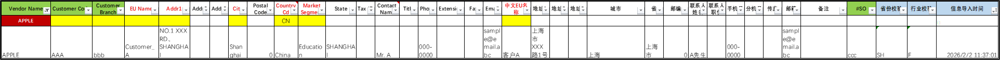
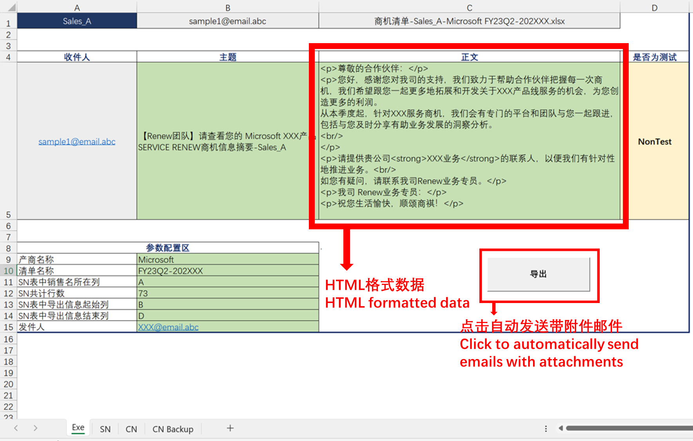
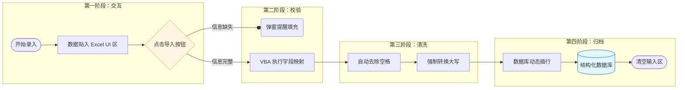
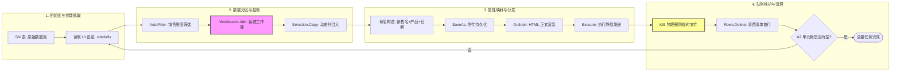

# VBA Automation Toolkit | 业务自动化工具集

[English](#english-version) | [中文版](#中文版)

---

## Preface | 前言

**English**: 

This repository serves as a professional portfolio showcasing a series of VBA-powered solutions, independently developed through self-directed research in early 2022 following my graduation, aimed at bridging the gap between manual business operations and digital efficiency. These tools were born in high-pressure corporate environments where rapid, reliable data processing was paramount; as such, each project reflects a pragmatic engineering mindset—prioritizing immediate productivity and the rapid delivery of business value. The choice of VBA was a strategic decision driven by restricted administrative permissions on corporate workstations at the time; in an environment where installing alternative programming frameworks was precluded, VBA emerged as the most viable and effective pathway for automation.

These early-stage projects document my growth trajectory within real-world applications. While some implementations—built by adapting legacy snippets and macro recording—may follow non-standard naming conventions (including legacy Chinese variable names) or rudimentary logic, they represent an authentic journey of problem-solving and a continuous evolution from mere "functional implementation" toward standardized, refined engineering practices. To preserve this authenticity, and considering the substantial workload involved in project review and data re-structuring, certain coding naiveties were intentionally left unaddressed.

Please note that as these projects involve highly confidential business terms, the demonstration code and datasets have been desensitized. All displayed data are synthetic and intended solely for demonstrating logical architecture.

**中文**：

本仓库作为个人职业作品集，展示了本人自毕业工作后在2022年年初为弥合手工业务操作与数字化效率差距通过自主钻研而独立开发的一系列VBA自动化解决方案。这些工具均诞生于真实的高压办公环境，以解决高频、低效的人工痛点为首要目标，因此每一个项目都体现了务实的工程思维，即优先保障业务价值的快速交付与流程自动化。在技术选型上，选用 VBA 主要是受限于当时办公电脑的系统权限限制，在无法安装其他编程环境的情况下，利用 VBA 成了实现自动化的最优路径。

仓库中的早期项目记录了我在实战中不断成长的轨迹。虽然部分代码在命名规范（如残留的中文变量名）或逻辑处理上仍显稚嫩，但它们见证了我从追求“功能实现”向追求“标准与精细化工程实践”迭代的演进过程。同时考虑到项目回顾整理及部分数据脱敏与重构化处理等所涉及到的工作量，对一些现存的代码幼稚化问题进行了适当的忽略，以保留项目真实性。

需要强调说明的是，由于如下项目可能涉及高度机密的客户商业条款，演示代码及数据已进行数据脱敏处理，所有展示数据均为合成数据，仅用于展示逻辑架构。

---

## 目录 | Table of Contents

### English Version
  - [Project 01: Enterprise Data Transcription Solution](#project-01-en)
    - [Overview](#ov-01-en) | [Context & Challenges](#context-01-en) | [Logic Flow](#flow-01-en) | [Implementations](#impl-01-en) | [Impact](#impact-01-en) |[Technical Deep Dive](#tech-01-en) | [Usage](#use-01-en) | [Tech Stack](#stack-01-en)
  - [Project 02: Multi-Stage Email Automation System (Evolutionary Suite)](#project-02-en)
    - [Overview](#ov-02-en) | [Evolution & Context](#context-02-en) | [Logic Flow](#flow-02-en) | [Implementations](#impl-02-en) | [Impact](#impact-02-en) |[Technical Deep Dive](#tech-02-en) | [Usage](#use-02-en) | [Tech Stack](#stack-02-en)

### 中文版
- [项目一：企业级客户数据自动化转录解决方案](#项目一-cn)
    - [项目概述](#概述-01-cn) | [业务背景与挑战](#背景-01-cn) | [流程图](#流程图-01-cn) | [核心功能](#功能-01-cn) | [业务产出](#产出-01-cn) | [技术核心解析](#解析-01-cn) | [使用说明](#说明-01-cn)| [技术栈](#技术栈-01-cn) 
- [项目二：多阶段邮件自动化分发系统（演进套件）](#项目二-cn)
    - [项目概述](#概述-02-cn) | [业务背景与演进历程](#背景-02-cn) | [流程图](#流程图-02-cn) | [核心功能](#功能-02-cn) | [业务产出](#产出-02-cn) | [技术核心解析](#解析-02-cn) | [使用说明](#说明-02-cn)| [技术栈](#技术栈-02-cn) 

---

<a name="english-version"></a>
## English Version

<a name="project-01-en"></a>
### 1. Project 01: Enterprise Data Transcription Solution

<a name="ov-01-en"></a>

#### **1.1 Overview**
This is a professional automation tool designed to bridge the gap between manual business operations and digital efficiency by transcribing 20,000+ unstructured records into a structured database.

<a name="context-01-en"></a>

#### **1.2 Business Context & Challenges**

* **Context:** In a sales operations scenario in early 2022, the team faced a massive data governance task: converting approximately 20,000 original customer information forms from Word (.docx) format into a standardized Excel database.

* **Pain Points:** Each Word form represented an individual customer. Over ten sales operators had to mechanically open each file, extract 20+ key fields (such as name, contact info, and address), and switch to Excel for manual pasting. This "carpet-style" entry method was not only tedious but also highly prone to misalignment or data loss.

* **Challenges:**

  * **Labor Cost:** Moving data between Word and Excel involved format compatibility issues. With a base of 20,000 files, even a 1-min processing time per file would total 300+ hours (approx. 40 full working days). This manual mode became a severe bottleneck in a business environment requiring rapid customer profiling.

  * **Quality Risk:** Since each record contained over 20 fields, high-intensity repetitive labor frequently led to manual errors such as field displacement or data overwriting, compromising the integrity of the business data.

<a name="flow-01-en"></a>

#### **1.3 Logic Flowchart**

<a name="impl-01-en"></a>

#### **1.4 Key Technical Implementations**
* **Automated Field Mapping**: Established direct cell-to-cell mapping logic to replace manual transcription, ensuring zero displacement of data fields.

* **Dynamic Archiving**: Implemented auto-insertion features to push new entries to the top, facilitating real-time verification and preventing data overwrites.

* **Vendor-Specific Adaptation**: Configured conditional triggers for 10+ major vendors (e.g., DELL, IBM) to automate categorization and business tagging.

* **Quality Control**: Integrated mandatory field checks and a "Clear Form" ("全部清除") macro to ensure data integrity and support a continuous, high-speed workflow.

* **Professional Recognition**：As a successful caser owner for the digitalization transformation in my previous department，I have received a written email of ppraisals for this from my manager.





<a name="impact-01-en"></a>

#### **1.5 Business Impact**

* **Quantum Leap in Efficiency:** By implementing a VBA-powered one-click import script, the processing time per record was reduced from minutes to seconds. Operators could complete an entry in mere seconds, ensuring the department obtained a clean, actionable dataset in record time.

* **Accuracy of Data Assets:** Automated execution eliminated inevitable manual errors (such as digit errors in phone numbers or column offsets), guaranteeing a high success rate for customer outreach in subsequent marketing phases.

* **Pioneering Digital Transformation:** Successfully validated the feasibility of using lightweight tools for large-scale data cleansing. This project established the department’s first standardized customer data dictionary, marking a transition from manual labor to automated governance.

<a name="tech-01-en"></a>
#### **1.6 Technical Deep Dive**
  * **Decoupled Mapping Engine**: Instead of unstable relative offsets, the code uses explicit cell referencing. This decoupling of UI and Logic ensures that changes in the form layout won't break the database integrity.
    ```VB
    Sheets("数据库").Range("C3").Value = Sheets("合同信息").Range("H3").Value
    Sheets("数据库").Range("AK3") = Format(Now, "yyyy-mm-dd hh:mm:ss")
    ```
    
  * **LIFO Archiving Logic**: Utilizing Rows(n).Insert, the tool creates a "Last-In-First-Out" effect. New records push historical data down, preventing the "end-of-row" overwrite risks common in basic VBA scripts.
    ```VB
    With Sheets("数据库")
        .Rows(3).Insert
        .Rows(5).Copy .Rows(3)
    ```
  
  * **Pre-archival Sanitization**: Integrated UCase functions and mandatory field validation loops to "clean" data before it hits the database, ensuring indexing fields (like Vendor IDs) remain standardized.
    ```VB
    Sheets("合同信息").Range("F3").Value = UCase(Sheets("合同信息").Range("F3").Value)
    ```

  * **Business-Driven Hardcoding**: Integrated conditional trigger logic (e.g., for vendors like DELL) to automatically assign static values to specific fields. This minimizes repetitive manual input for standardized vendor attributes and ensures 100% compliance with business-specific data defaults.
    ```VB
    ElseIf Range("A2").Value = "VENDOR_P" Then
    Range("I2").Value = ""
    Range("L2").Value = ""
    Range("N2").Value = ""
    Range("P2").Value = ""
    Range("S2").Value = ""
    Range("U2").Value = "Y"
    Range("X2").Value = "Y"
    Range("Y2").Value = ""
    Range("Z2").Value = "Y"
    ```
  * **Full Source Code**: You can find the full source code by visting [this folder](./Project01/Code) or clicking below links:
  
    * **UI Page**: [Click to View](./Project01/Code/UI_Preview.cls)
    * **Datebase Page**: [Click to View](./Project01/Code/Database_Preview.cls)
    * **Data Import Macro**: [Click to View](./Project01/Code/Import_Button.bas)
    * **Clear Form Macro**: [Click to View](./Project01/Code/Clear_Button.bas)

<a name="use-01-en"></a>
#### **1.7 How to Use**

  1. Download the [template](./Project01/Project01_Data_Transcription_Tool.xlsm.xlsm) and ensure Macros are enabled in Excel.
    
  2. Paste the source Word data into the designated "Input UI" ("合同信息") sheet.
    
  3. Click the **Submit** ("导入数据") button to archive data and **Clear** ("全部清除") to reset the form for the next entry.


  <a name="stack-01-en"></a>

#### 	**1.8 Technical Stack**
  * VBA (Excel Macros) 
  * Microsoft Excel 

---

  <a name="project-02-en"></a>
  ### 2. Project 02: Multi-Stage Email Automation System (Evolutionary Suite)

**Note:** This project includes both v1.0 (Legacy) and v2.0 (Advanced) versions. To highlight technical evolution, the following documentation and code analysis are based on v2.0. (Click [here](./Project02/Batch_Email_Sender_v1_Legacy.xlsm) to view the v2.0 overview.)

<a name="ov-02-en"></a>

  #### **2.1 Overview**

This project implements a full-lifecycle email automation workflow powered by VBA. The core logic encompasses dimensional filtering from master datasets, dynamic generation of individual attachment workbooks, personalized dispatching via the Outlook object model, and physical cleanup of local caches upon task completion. The tool is designed to replace high-frequency manual operations—such as report splitting, renaming, and file mounting—with a standardized, programmatic process.

<a name="context-02-en"></a>

  #### **2.2 Evolution & Business Context**

  * **v1.0 Standardized Dispatch (Early 2022):**

    * **Context:** Designed for "Contract Renewal" notifications within a Sales Operations team.

    * **Logic:** Achieved automated batch sending based on fixed lists and uniform PDF attachments, transitioning from manual handling to basic automation.

  * **v2.0 Dynamic Customized Dispatch (Mid 2022):**

    * **Context:** During the business operations phase, I was responsible for managing a master dataset containing company customer product information. This data needed to be distributed to over 10 sales representatives for business follow-ups. The dataset was updated dynamically based on business cycles, typically covering approximately 2,000+ rows per update.

    * **Evolution:** Refactored on the v1.0 foundation by introducing a "Dynamic Data Partitioning Engine," enabling the generation of customized data attachments tailored to specific recipients.

    * **Pain Points:** Data privacy is paramount in business operations; each representative must only access leads assigned to them. Furthermore, for archival purposes, attachment filenames were required to strictly follow a format including the representative's name, date, and specific product line.

    * **Challenges:** This is a classic "one-to-many" personalized distribution scenario. Using traditional methods would require a repetitive loop of "filtering, creating new workbooks, renaming, drafting emails, and mounting attachments" repeated over ten times. Under the pressure of thousands of rows of data, manual handling is highly susceptible to "data cross-contamination" (sending Rep A's data to Rep B), which poses a significant data security and compliance risk.

<a name="flow-02-en"></a>

#### **2.3 Logic Flowchart**

```mermaid
graph LR
    subgraph Init [1. Initialization & Parameter Fetching]
    A[SN Sheet: Master Data] --> B[Read UI Config: st/ed/dls]
    end

    subgraph Filter [2. Partitioning & Injection]
    B --> C[AutoFilter: Split by Sales Rep]
    C --> D[Workbooks.Add: Create Temp Workbook]
    D --> E[Selection.Copy: Dynamic Column Injection]
    end

    subgraph Mail [3. Attribute Mapping & Dispatch]
    E --> F[Filename Construction: Rep+Product+Date]
    F --> G[SaveAs: Attachment Persistence]
    G --> H[Outlook: HTML Rendering]
    H --> I[Execute: Silent Send]
    end

    subgraph Cleanup [4. Queue Maintenance & Sanitization]
    I --> J[Kill: Physical Cache Deletion]
    J --> K[Rows.Delete: Consume Queue Head]
    K --> L{Is A2 Empty?}
    L -- No --> B
    L -- Yes --> M([Task Completed])
    end

    style D fill:#f9f,stroke:#333,stroke-width:2px
    style J fill:#ff9,stroke:#333,stroke-width:2px
```



<a name="impl-02-en"></a>

#### **2.4 Key Technical Implementations**

* **Dynamic Data Fetching & Workbook Injection:** Utilizing AutoFilter to isolate target rows in the SN sheet, the system defines the copy range by reading UI-specified start (st) and end (ed) column indices. It then invokes Workbooks.Add to create a new memory object and "injects" the filtered data stream, achieving physical isolation between the source database and the distributed attachments.



* **Composite Attribute Mapping & Naming Conventions:**

  * **Attachment Naming:** Automatically concatenates UI variables following the rule: Business_Lead_[Sales_Rep]_[Product]_[Date].xlsx.

  * **Email Component Generation:** Programmatically generates unique subjects containing sales rep names and maps HTML source code maintained in Excel to the HTMLBody property for professional cross-platform rendering.

* **Multi-Environment Sandbox Verification:** Features a NonTest / Test logical toggle. In Test mode, the code intercepts the actual recipient address and redirects the mail flow to a developer's inbox, establishing a secure pre-release validation mechanism.

* **Automated Lifecycle Management:** Executes the Kill command combined with ThisWorkbook.Path to destroy temporary local attachments immediately after they enter the dispatch queue, ensuring data privacy and "zero-residue" on the local environment.

<a name="impact-02-en"></a>

#### **2.5 Business Impact**

* **Physical Data Isolation & Secure Distribution:** By implementing automated filtering and new workbook generation logic, the system ensures from a technical standpoint that each representative only accesses authorized data, completely eliminating the risk of business privacy leaks.

* **Branded & Standardized Delivery:** Standardized attachment naming (e.g., Leads_List-John_Doe-Product_XXX_20260201.xlsx) generated via code significantly enhanced the professional support provided by Sales Operations to the front-line teams.

* **Maximizing Productivity:** Achieved "unattended" distribution. The business operator (myself) only needs to verify the master table and click a button to complete precise distribution in minimal time. This allows the team to focus on strategic analysis for lead conversion rather than tedious file-handling tasks.

<a name="tech-02-en"></a>

#### **2.6 Technical Deep Dive**

* **"Consume-and-Delete" Task Queue Design:** The main loop employs a While...Wend structure that always uses the second row of the CN sheet as the current operational handle, followed by Rows(2).Delete upon completion. This ensures the macro remains focused on the head of the queue, simplifying index logic and significantly enhancing stability during large-scale processing.

  ```VB
  While Sheets("CN").Range("A2").Value <> ""
    ' ... (中间业务逻辑)
      
    ' [发送指令后执行删除]
    Kill efg
    Sheets("CN").Rows(2).Delete
      
    If m = 1 Then
        Sheets("Exe").Range("A1").Select
    Else
        Sheets("Exe").Range("B1").Select
    End If
  Wend
  ```

* **Multi-Environment Simulation & Attribute Redirection:**

  ```VB
  If Sheets("Exe").Range("D5").Value = "NonTest" Then
      Sheets("Exe").Range("A5").Value = Sheets("CN").Range("B2").Value
  Else
      Sheets("Exe").Range("A5").Value = Sheets("Exe").Range("B15").Value
  End If
  ```

  * **Technical Principle:** Simulates the "Production/Test Isolation" concept in software engineering. In Test mode, the system alters the assignment path of the MailItem.To property, redirecting the mail flow to a verification address to ensure the test process remains identical to the actual business flow.

  * **Risk Mitigation:** By setting a logical interception barrier before the core send command, it allows for a secure preview of results without affecting the underlying data fetching or HTML rendering logic, mitigating compliance risks caused by template errors.

* **COM Interoperability (Late Binding) & Mapping System:**
The system utilizes CreateObject("Outlook.Application") for late binding, dispatching COM interfaces without requiring manual references to external type libraries.

  ```VB
  Set okapp = CreateObject("Outlook.Application")
  Set ok = okapp.CreateItem(olMailItem)
  efg = ThisWorkbook.Path & Sheets("Exe").Range("C1").Value
  With ok
      .from = Sheets("Exe").Range("B15").Value
      .display
      .to = Sheets("Exe").Range("A5").Value
      .cc = Sheets("CN").Range("C2").Value
      .Subject = Sheets("Exe").Range("B5").Value
      .HTMLBody = Sheets("Exe").Range("C5").Value & .HTMLBody
      .attachments.Add efg
      .send
  End With
  ```

  * **Object Decoupling:** Ensures downward compatibility across different Office versions, enhancing robustness in heterogeneous environments.

  * **Multi-Source Attribute Aggregation:** Dynamically fetches addresses from Exe config cells and CN list items, constructs unique subjects by concatenating business prefixes and customer IDs, and anchors physical files by combining ThisWorkbook.Path with real-time generated filenames.

    * **Recipient/CC (To/CC):** The system dynamically fetches email addresses from various coordinates within the Exe config sheet and the CN task list based on the active environment mode (Test/Non-Test), subsequently assigning them to the MailItem object.

    * **Dynamic Subject Construction (Subject):** By reading real-time configurations from the Exe sheet, the system performs string concatenation of "Business Prefix," "Product Model," and "Customer/Sales Identifier" to ensure the uniqueness and professionalism of each email subject.

    * **Attachment Persistence (Attachments):** The system utilizes ThisWorkbook.Path to retrieve the current absolute environment path and concatenates it with the "Dynamic Filename" generated in cell Exe.C1. This allows for precise physical file localization and seamless API mounting.

    * **HTML Content Rendering:** The logic performs a structural merge of HTML string fragments from Excel cells with the default Outlook signature, assigning the result to the HTMLBody property to ensure consistent layout and formatting across different platforms.

  * **Parameterized Range Control & Dynamic Injection:** To adapt to various business datasets, the system replaces hard-coded ranges with parameterized rules:

    * **Dynamic Range Definition:** Reads st (Start Column) and ed (End Column) from the UI to lock the EntireColumn via Cells(1, st) and Cells(1, ed).

    * ***Injection Logic:** Locates the baseline range via dls (Filter Column) and performs the Copy operation only on the user-defined range after AutoFilter execution, allowing the tool to adapt to field changes without modifying source code.

    ```VB
    st = Sheets("Exe").Range("B13").Text
    ed = Sheets("Exe").Range("B14").Text
    dls = Sheets("Exe").Range("B11").Text
    sum = Sheets("Exe").Range("B12").Text

    ' ...

    Set rg = Sheets("SN").Range(dls & "1:" & dls & sum)
    rg.AutoFilter Field:=1, Criteria1:=Sheets("Exe").Range("A1").Value
        Sheets("SN").Select
        Range(Cells(1, st), Cells(1, ed)).EntireColumn.Select
        Selection.Copy
        Workbooks.Add
        ActiveSheet.Paste
    ```

* **Event-Driven UI Normalization:** Implements Worksheet_SelectionChange to listen for user input. It triggers the UCase function for instant identifier standardization and updates attachment previews in real-time, providing a "What You See Is What You Get" (WYSIWYG) interactive experience.

* **Full Source Code**: You can find the full source code by visting [this folder](./Project02/Code) or clicking below links:
  
  * **UI Page**: [Click to View](./Project02/Code/Exe_UI.cls)

  * **Data Import Macro**: [Click to View](./Project02/Code/Import_Button.bas)

<a name="use-02-en"></a>

#### 	**2.7 How to Use**

1. Download the [template](./Project02/Dynamic_Data_Distributor_v2_General.xlsm) and ensure Macros are enabled in Excel.

2. Configure business parameters (column ranges, mode toggle, HTML source, etc.) in the Exe sheet.

3. Place raw data in the SN sheet and the recipient list in the CN sheet.

4. Select Test mode first to verify attachment naming and email body rendering.

5. Click "Execute"; the system will begin cyclic distribution and update the list status in real-time.

<a name="stack-02-en"></a>

#### 	**2.8 Technical Stack**

* VBA (Excel & Outlook Integration) 
* Microsoft Excel 

* Microsoft Office Object Model 

* HTML/CSS (Email Template Design) 

---


<a name="中文版"></a>

## 中文版

<a name="项目一-cn"></a>
### 1. 项目一：企业级客户数据自动化转录解决方案

<a name="概述-01-cn"></a>
#### **1.1 项目概述**
本工具是一款针对大规模（20,000+条）非结构化表单开发的转录与归档解决方案，实现了从 Word 格式化表单到 Excel 结构化数据库的自动化处理。
<a name="背景-01-cn"></a>

#### **1.2 业务背景与存有的挑战**

* **背景：** 在 2022 年前司的销售运营场景中，团队面临一项极其繁重的数据治理任务：需要将约20,000份从 Word (.docx) 格式收集来的原始客户信息表，转化为标准化的 Excel 数据库。

* **痛点：** 每份 Word 表单对应一个客户，十余名业务员需要机械地打开文件、手动提取姓名、联系方式、地址等20多个关键字段、再切换到 Excel 粘贴。这种地毯式的录入方式不仅枯燥，且极易产生数据错位或漏录。

* **困难：**

  * **人力成本：** 跨软件迁移存在格式兼容性问题。2万份的庞大基数意味着即使每份仅耗时1分钟，总工时也将高达200+小时（约40个完整工作日）。在急需建立客户画像并进行营销跟进的商务环境下，人工模式已成为业务流转的严重瓶颈。

  * **质量风险：** 每条记录涉及字段繁多，高强度的重复劳动极易导致字段错位、数据覆盖等人工失误，严重影响后续数据的使用价值。

<a name="流程图-01-cn"></a>

#### **1.3 流程图**


<a name="功能-01-cn"></a>
#### **1.4 核心功能实现**
* **自动化字段映射**：通过 VBA 建立 UI 录入区与数据库之间的精确映射，实现一键转录，消除了手动切换窗口的误差。
  
* **动态归档逻辑**：采用自动插行技术，确保新数据始终置顶，方便实时核对并防止历史记录被覆盖。
  
* **多维度业务逻辑适配**：针对 DELL、IBM 等 10 余个厂商的特殊规则设计条件触发逻辑，实现业务数据的自动化分类。
  
* **流程优化机制**：内置必填项验证机制（如厂商名、客户代码）并提供一键清除功能，支持高频连续作业。


      

      
<a name="产出-01-cn"></a>

#### **1.5 业务产出**

* **交付效能跨越式提升：** 通过 VBA 脚本实现一键式数据复制与导入，将 20,000 条数据的单条处理时间从分钟级缩短至秒级。业务员仅需几秒即可完成录入，确保了部门能以极速获取干净、可用的数据集。

* **保障数据资产准确性：** 代码执行规避了人工录入中不可避免的失误（如电话号码位数错误、列对齐偏移），确保了后续商务营销阶段客户触达的成功率。

* **数字化转型初试：** 成功验证了利用轻量化工具解决大规模数据清洗任务的可行性，为部门建立了第一套标准化的客户数据字典，实现了从手工劳动向自动化治理的跨越。

* **职业认可**：作为部门数字化转型的成功实践，获得了部门负责人的书面邮件表扬。

<a name="解析-01-cn"></a>

#### **1.6 技术核心解析**
* **映射引擎原理**：放弃了不稳定的相对位移，采用显式单元格引用。这意味着即使 UI 界面为了美观调整了行列，只需更改映射表即可快速适配，体现了逻辑与界面的解耦思想。
  ```VB
  Sheets("数据库").Range("C3").Value = Sheets("合同信息").Range("H3").Value
  Sheets("数据库").Range("AK3") = Format(Now, "yyyy-mm-dd hh:mm:ss")
  ```
  
* **堆栈式归档**：通过 Rows.Insert 模拟堆栈操作。新记录入库时，旧记录自动下移。这种设计避免了传统 VBA 修改末行记录时可能发生的覆盖风险。
  ```VB
  With Sheets("数据库")
      .Rows(3).Insert
      .Rows(5).Copy .Rows(3)
  ```

* **源头质量控制**：在入库前通过 UCase 和逻辑判断进行“输入清洗”，确保了诸如供应商 ID 等关键索引字段的标准化。
  ```VB
  Sheets("合同信息").Range("F3").Value = UCase(Sheets("合同信息").Range("F3").Value)
  ```
* **业务驱动的自动赋值**：针对特定厂商（如 DELL）设计了条件触发硬编码逻辑。对于某些固定字段，系统会自动判定并填充预设值（如 Y/N 标识），极大减少了业务员处理标准化合同时的重复操作，从技术底层确保了业务规则的刚性执行。
  ```VB
  ElseIf Range("A2").Value = "VENDOR_P" Then
  Range("I2").Value = ""
  Range("L2").Value = ""
  Range("N2").Value = ""
  Range("P2").Value = ""
  Range("S2").Value = ""
  Range("U2").Value = "Y"
  Range("X2").Value = "Y"
  Range("Y2").Value = ""
  Range("Z2").Value = "Y"
  ```

* **完整代码**：可访问[此文件夹](./Project01/Code)或点击以下链接查看：
  
  * **信息表主页**: [点击查看](./Project01/Code/UI_Preview.cls)
  * **数据库**: [点击查看](./Project01/Code/Database_Preview.cls)
  * **数据导入按钮**: [点击查看](./Project01/Code/Import_Button.bas)
  * **数据清除按钮**: [点击查看](./Project01/Code/Clear_Button.bas)

<a name="说明-01-cn"></a>

#### **1.7 使用说明**
1. 下载[文件](./Project01/Project01_Data_Transcription_Tool.xlsm.xlsm)并启用 Excel 宏。
   
2. 将 Word 表格数据粘贴至输入工作表的指定区域。
   
3. 点击“导入数据”完成归档，点击“全部清除”开始下一条录入。


#### **1.8 技术栈**
* VBA (Excel宏) 
* Microsoft Excel 

---

<a name="项目二-cn"></a>
### 2. 项目二：多阶段邮件自动化分发系统（演进套件）

**注：**本项目资源文件夹中包含 v1.0（团队通用版）与 v2.0（进阶自用版）两个文件。为聚焦技术演进，本说明文档及后续代码解析均以 v2.0 版本为例（旧版项目可点击[此处](./Project02/Batch_Email_Sender_v1_Legacy.xlsm)查看）。

<a name="概述-02-cn"></a>
#### **2.1 项目概述**
本项目实现了一套基于 VBA 的全链路自动化邮件分发工作流。系统核心逻辑涵盖了从大型原始数据集（Master Data）中进行维度筛选、动态创建独立附件工作簿、调用 Outlook 对象模型执行个性化分发、以及任务完成后的本地缓存物理清理。该工具旨在通过程序化手段替代高频的人工拆表、命名与发送操作，实现业务分发的标准化。

<a name="背景-02-cn"></a>
#### **2.2 业务背景**

* **v1.0 标准化分发 (2022年初)：**

  * **场景：** 服务于前司销售运营团队使用邮件向客户群体的业务提醒任务。

  * **逻辑：** 实现了基于固定清单和统一 PDF 附件的自动化群发逻辑，解决了从手工发送到批量处理的初级转化。

* **v2.0 动态定制分发 (2022年中)：**

  * **背景：** 在业务运营阶段，我需要管理一份包含公司客户产品数据的汇总大表，并根据销售归属，定期将特定数据分发给 10 余位销售代表进行商务跟进。该表格会根据业务情况动态更新，每次涵盖数据平均约 2,000 余行。

  * **演进历程：** 在 v1.0 标准化分发的逻辑基础上进行了深度重构，引入了“动态数据分区引擎”。该引擎支持根据不同的接收者需求，实时生成定制化的数据附件，实现了从“统一附件群发”向“个性化数据推送”的技术跨越。

  * **痛点：** 商务侧对数据隐私有极高要求，每位销售代表仅能看到其名下的商机。此外，为了方便销售人员后续存档，分发的附件名必须严格包含销售姓名、日期及具体产品线。

  * **困难：** 这是典型的“一对多”个性化分发。若采用传统筛选法，需进行“手动筛选、新建表、重命名存盘、撰写邮件、挂载附件”这一闭环操作并重复十余次。在数千行数据的压力下，人工操作极易导致“数据串门”（将 A 销售的数据发给 B 销售），这在商业环境中属于严重的数据安全合规风险。

<a name="流程图-02-cn"></a>
#### **2.3 流程图**


<a name="功能-02-cn"></a>

#### **2.4 核心功能**实现

* **动态数据拉取与工作簿注入：** 系统利用 AutoFilter 筛选 SN 表中的目标行，通过读取 UI 设定的起始列（st）与结束列（ed）定义复制范围，随后调用 Workbooks.Add 创建全新的内存对象，并将筛选后的数据流精准“注入”新表。该逻辑实现了原始数据库与分发附件的物理隔离。


* **复合属性映射与命名规则：**

  * **附件命名逻辑：** 系统自动抓取 UI 变量进行字符串拼接，规则为：商机清单-[销售名]-[产品类型]-[日期].xlsx。

  * **邮件组件生成：** 通过代码联动，动态生成带有销售姓名的特定主题，并将 Excel 中维护的 HTML 源码映射至 HTMLBody 属性，实现专业格式的正文渲染。

* **多环境沙盒验证逻辑：** 内置 NonTest / Test 逻辑分支。在测试模式下，代码通过 If 判断强制拦截真实收件人地址并重定向至开发者邮箱，建立了一套安全的预发布验证机制。

* **文件生命周期自动化管理：** 利用 Kill 指令配合 ThisWorkbook.Path，在附件成功进入分发队列后立即销毁本地缓存文件，在确保数据隐私的同时实现了本地环境的“零残留”。

<a name="产出-02-cn"></a>

#### **2.5 业务产出**

* **操作一致性：** 通过预设的逻辑规则，消除了人工在拆表、重命名及挂载附件过程中产生的随机性失误。

* **交付效能提升：** 将涉及多表筛选、文件创建、个性化命名及逐一发信的复合任务周期由数小时缩短至分钟级。

* **合规性增强：** 通过即时清理机制，确保了在企业环境下敏感商业数据的本地零留存。

<a name="解析-02-cn"></a>

#### **2.6 技术核心解析**

* **基于“消费-删除”机制的任务队列逻辑：** 主循环采用 While...Wend 结构。程序始终以 CN 清单表的第二行作为当前操作句柄，处理完成后执行 Rows(2).Delete。这种设计确保了宏始终聚焦于队列首位，简化了数组索引逻辑，显著提升了处理大规模清单时的稳定性。

  ```VB
  While Sheets("CN").Range("A2").Value <> ""
    ' ... (中间业务逻辑)
      
    ' [发送指令后执行删除]
    Kill efg
    Sheets("CN").Rows(2).Delete
      
    If m = 1 Then
        Sheets("Exe").Range("A1").Select
    Else
        Sheets("Exe").Range("B1").Select
    End If
  Wend
  ```

* **多环境模拟与属性重定向逻辑：** 系统在发信模块中引入了基于 UI 状态位的条件分支逻辑（If Range("D5").Value = "NonTest"）。

  ```VB
  If Sheets("Exe").Range("D5").Value = "NonTest" Then
      Sheets("Exe").Range("A5").Value = Sheets("CN").Range("B2").Value
  Else
      Sheets("Exe").Range("A5").Value = Sheets("Exe").Range("B15").Value
  End If
  ```

  * **技术原理：** 该逻辑模拟了软件开发中的“生产/测试环境隔离”思想。在 Test 模式下，程序并不阻断工作流，而是通过改变 MailItem.To 属性的赋值逻辑，将原本指向外部客户的邮件流实时重定向至内部验证地址，确保了测试过程与实际业务流的完全一致。

  * **风险防范机制：** 通过在核心发送命令前设置物理层面的逻辑拦截屏障，允许在不影响底层数据抓取、工作簿生成及 HTML 渲染逻辑的前提下，实现对分发结果的安全预览。这有效规避了由于模板配置错误、HTML 逻辑故障或附件关联异常导致的合规风险。

* **双层 UI 联动与实时规范化：** 通过 Worksheet_SelectionChange 事件实时监听用户输入。在交互阶段即时触发 UCase 函数对标识符进行标准化对齐，并实时更新附件名预览，实现了“所见即所得”的前端交互体验。
  ```VB
  Private Sub Worksheet_SelectionChange(ByVal Target As Range)
      Sheets("Exe").Range("B11").Value = UCase(Sheets("Exe").Range("B11").Value)
      Sheets("Exe").Range("B13").Value = UCase(Sheets("Exe").Range("B13").Value)
      Sheets("Exe").Range("B14").Value = UCase(Sheets("Exe").Range("B14").Value)
      Sheets("Exe").Range("A1").Value = Sheets("CN").Range("A2").Value
      Sheets("Exe").Range("B1").Value = Sheets("CN").Range("B2").Value
      Sheets("Exe").Range("C1").Value = "商机清单-" & Sheets("Exe").Range("A1").Value & "-" & Sheets("Exe").Range("B9").Value & " " & Sheets("Exe").Range("B10").Value & ".xlsx"
      ' ...
  End Sub
  ```


* **参数化列范围控制：** 为了适配不同维度的业务大表，系统摒弃了硬编码范围，采用了参数化取值规则：

  * **动态范围定义：** 系统从 UI 界面读取 st（起始列索引）与 ed（结束列索引）变量，通过 Cells(1, st) 与 Cells(1, ed) 动态锁定 EntireColumn。

  * **筛选与注入逻辑：** 通过 dls（筛选列标识）定位 SN 表的基准范围，在执行 AutoFilter 筛选后，仅对用户定义的动态列范围执行 Copy 操作并注入至新创建的 Workbook 对象中。该设计使得工具无需修改底层代码即可灵活适配字段增减。
  ```VB
  st = Sheets("Exe").Range("B13").Text
  ed = Sheets("Exe").Range("B14").Text
  dls = Sheets("Exe").Range("B11").Text
  sum = Sheets("Exe").Range("B12").Text

  ' ...

  Set rg = Sheets("SN").Range(dls & "1:" & dls & sum)
  rg.AutoFilter Field:=1, Criteria1:=Sheets("Exe").Range("A1").Value
      Sheets("SN").Select
      Range(Cells(1, st), Cells(1, ed)).EntireColumn.Select
      Selection.Copy
      Workbooks.Add
      ActiveSheet.Paste
  ```

* **COM 组件互操作性** 
  系统通过 CreateObject("Outlook.Application") 实现后期绑定，在无需手动引用 Outlook 类型库的前提下，动态调度 COM 接口执行属性映射。

  ```VB
  Set okapp = CreateObject("Outlook.Application")
  Set ok = okapp.CreateItem(olMailItem)
  efg = ThisWorkbook.Path & Sheets("Exe").Range("C1").Value
  With ok
      .from = Sheets("Exe").Range("B15").Value
      .display
      .to = Sheets("Exe").Range("A5").Value
      .cc = Sheets("CN").Range("C2").Value
      .Subject = Sheets("Exe").Range("B5").Value
      .HTMLBody = Sheets("Exe").Range("C5").Value & .HTMLBody
      .attachments.Add efg
      .send
  End With
  ```
  其属性构造逻辑如下：

  * **对象解耦机制：** 后期绑定确保了代码在不同 Office 版本间的向下兼容性，避免了因引用库版本冲突导致的编译中断（鲁棒性增强）。

  * **多源属性聚合逻辑：**

    * **收件人/抄送 (To/CC)：** 系统根据环境模式从 Exe 表及 CN 清单表的不同坐标动态抓取地址，并将其赋值给 MailItem 对象。

    * **动态主题构造 (Subject)：** 系统实时读取 Exe 表配置，将“业务前缀”、“产品型号”与“客户/销售标识”进行字符串拼接，实现主题的唯一性。

    * **附件持久化关联 (Attachments)：** 通过 ThisWorkbook.Path 获取当前环境绝对路径，并与 Exe.C1 单元格实时生成的“动态文件名”拼接，精确定位物理文件并完成 API 挂载。

    * **HTML 内容渲染：**　直接将 Excel 单元格中的 HTML 字符串片段与 Outlook 默认签名进行逻辑拼合，并赋值给 HTMLBody 属性，实现排版格式的跨平台一致性。

* **完整代码**：可访问[此文件夹](./Project02/Code)或点击以下链接查看：
  
  * **Exe表主页**: [点击查看](./Project02/Code/Exe_UI.cls)

  * **数据导入按钮**: [点击查看](./Project02/Code/Import_Button.bas)

<a name="说明-02-cn"></a>
#### **2.7 使用说明**

1. 下载[文件](./Project02/Dynamic_Data_Distributor_v2_General.xlsm)并启用 Excel 宏。

2. 在 Exe 工作表配置业务参数（包括列范围、模式切换、HTML 源码等）。

3. 将完整原始数据置于 SN 表，待处理人员清单置于 CN 表。

4. 执行宏前建议首先选择 Test 模式进行自测，验证生成的附件命名及邮件正文逻辑。

5. 确认无误后点击“执行”按钮，系统将自动开始循环分发，并根据进度实时更新清单状态。

<a name="技术栈-02-cn"></a>

#### **2.8 技术栈**
* VBA (Excel宏) 
* Microsoft Excel 

* Microsoft Office 对象模型 

* HTML/CSS (邮件模板排版) 

